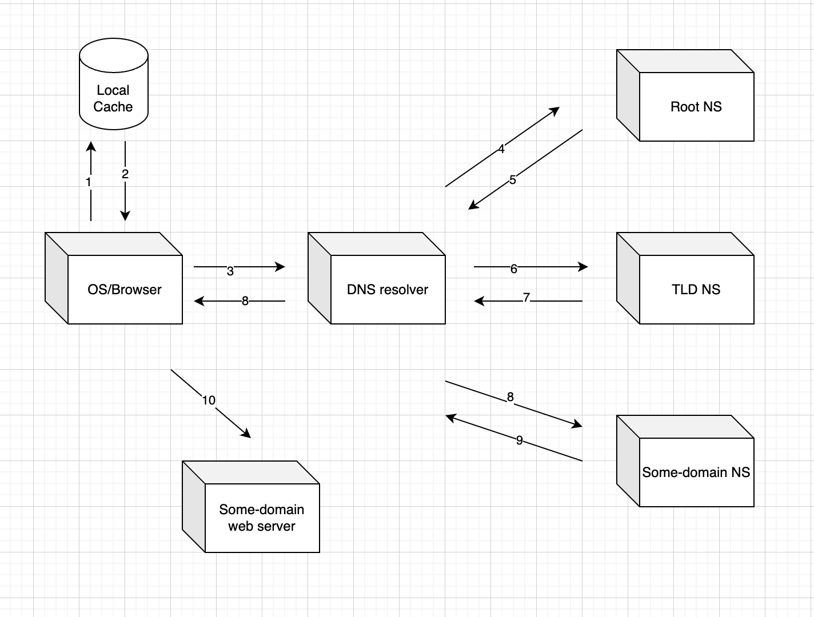

**Every time you type a domain name, DNS kicks off a seamless journey to find the exact server you’re looking for.**

#### What is DNS?

Each device connected to internet has a unique **Internet Protocol (IP)** address, with this IP address other machines can find the device. People access information online through domain names. For who don’t know domain name is basically the names that end with .com .io for example:

[amazon.com](http://amazon.com), [ogutdgn.com](http://ogutdgn.com) (my domain 😀) DNS is the thing that translates domain names to IP addresses so browsers can load internet resources. So technically DNS servers eliminate the need for people to memorize IP addresses.

→ Example of an IP address: 192.168.1.1 — so instead of writing these kind of ip addresses we are jsut writing a domain name.

#### How DNS looks up for websites?

Computers don't understand domain names, they only understand IP addresses. When we type a domain name and press enter, let's see what happens in order:

1. Our request first goes to **DNS resolver**, the resolver first search for the temporary cache which stores the results of recent DNS lookups in our local computer.
2. If not found locally, it connects to the **Internet Service Provider (ISP)** and its **DNS server**. ISP is the operator that provides your internet connection. You reach to ISP from your home router (wifi modem) or a cell tower if you're outside.
4. The resolver then queries the **root servers**. Root servers know the locations of all **Top Level Domains (TLDs)** such as .com, .io, .app. They tell the resolver which server to go to for that domain.
5. The resolver goes to that TLD server and asks "where can i found some-domain.com?" The TLD server responds: "I don't know the exact IP, but here are the name servers for some-domain.com". example name servers: ns1.some-domain.com and ns2.some-domain.com.
6. Name servers stores DNS records of the domain. The resolver queries the name server, and name server responds with the IP address. It responds with an A record (IPv4) or AAAA record (IPv6). IPv4 and IPv6 are 2 different types of **Internet Protocol (IP)**. We will also talk about what is 'A' and 'AAAA' records are, keep reading.
7. The resolver passes the IP to the operating system, which passes it to the browser. The browser can now connect to that IP address.

#### DNS Record Types

DNS records map domain names to IP addresses and manage services like email and web traffic. They are stored in name servers. There are so many types of DNS records, because of that I will just give the meaning of most used ones. You can search for others :) I have took the record explenations from cloudfare (https://www.cloudflare.com/learning/dns/dns-records/), they also include learn more links. You can learn more things in those links.

**Commonly Used DNS Record Types: **

- **A record** - The record that holds the IP address of a domain. [Learn more about the A record.](https://www.cloudflare.com/learning/dns/dns-records/dns-a-record/)
- **AAAA record** - The record that contains the IPv6 address for a domain (as opposed to A records, which list the IPv4 address). [Learn more about the AAAA record.](https://www.cloudflare.com/learning/dns/dns-records/dns-aaaa-record/)
- **CNAME record** - Forwards one domain or subdomain to another domain, does NOT provide an IP address. [Learn more about the CNAME record.](https://www.cloudflare.com/learning/dns/dns-records/dns-cname-record/)
- **MX record** - Directs mail to an email server. [Learn more about the MX record.](https://www.cloudflare.com/learning/dns/dns-records/dns-mx-record/)
- **TXT record** - Lets an admin store text notes in the record. These records are often used for email security. [Learn more about the TXT record.](https://www.cloudflare.com/learning/dns/dns-records/dns-txt-record/)
- **NS record** - Stores the name server for a DNS entry. [Learn more about the NS record.](https://www.cloudflare.com/learning/dns/dns-records/dns-ns-record/)
- **SOA record** - Stores admin information about a domain. [Learn more about the SOA record.](https://www.cloudflare.com/learning/dns/dns-records/dns-soa-record/)
- **SRV record** - Specifies a port for specific services. [Learn more about the SRV record.](https://www.cloudflare.com/learning/dns/dns-records/dns-srv-record/)
- **PTR record** - Provides a domain name in reverse-lookups. [Learn more about the PTR record.](https://www.cloudflare.com/learning/dns/dns-records/dns-ptr-record/)

#### DNS Cache and TTL (Time to Live)

***DNS Cache*** -> Instead of going to root server and asking for IP address again and again, storing the known IP address at **operating system (OS), browser, **and **ISP (Internet Search Provider)**.

***TTL (time to live) ***-> How much time should this IP address needs to be stored. When the time is up, IP address is deleting from the cache. TTL's are valued in seconds. TTL -> 300 -> 5 minutes.

Sources: 

https://www.cloudflare.com/learning/dns/what-is-dns/

https://www.cloudflare.com/learning/dns/dns-records/

https://shiftasia.com/community/what-happen-when-access-website/

****
