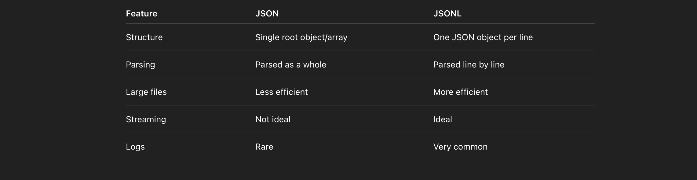

#### What is JSON?


**JSON (JavaScript Object Notation)** is a structured data format used for storing and transferring data.
It’s widely used in APIs, configuration files, and web applications.


*JSON Example*

```json title="json-example"
[
  {
    "id": 1,
    "name": "John",
    "age": 25
  },
  {
    "id": 2,
    "name": "Jane",
    "age": 30
  }
]
```


Key Characteristics

- Data lives inside a single root structure (`[]` or `{}`).
- The entire file is parsed at once.
- Ideal for small to medium-sized datasets.
- Commonly used in API responses.


#### What is JSONL?

**JSONL (JSON Lines)**, also known as **NDJSON**, stores one valid JSON object per line.

Instead of wrapping everything inside an array, each line is independent.


*JSONL Example*

```json title="jsonl-example"
{"id": 1, "name": "John", "age": 25}
{"id": 2, "name": "Jane", "age": 30}
```


Key Characteristics

- Each line is a standalone JSON object.
- Easy to process line by line.
- Great for large datasets.
- Commonly used for logs and machine learning datasets.
- Suitable for streaming data.





#### When Should You Use Each?

Use **JSON** when:

- Building APIs
- Writing configuration files
- Working with small/medium datasets

Use **JSONL** when:

- Handling large datasets
- Processing streaming data
- Storing logs
- Preparing ML training data


#### Quick Summary

- **JSON** = One structured document
- **JSONL** = Many small JSON documents, one per line
- Small data → JSON
- Large or streaming data → JSONL


